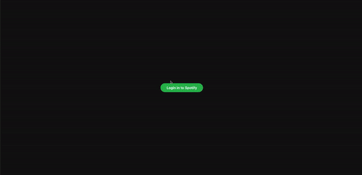

<h1 align="center">Grooves - Track trends in your music taste & more!</h1>
<p>
</p>

> App that allows you to track trends in your music taste and sort your favorite tracks by danceability, energy, and tempo. 

## Usage
Run the following command in the root directory:

```sh
npm start
```

Once the app is running you can login with your Spotify account to track trends in your music and sort music by audio features (i.e. danceability, energy, and tempo).

## Demo



## Author

👤 **Ty Facey**

* Website: https://ty-personal-portfolio.vercel.app/
* Github: [@faceyacc](https://github.com/faceyacc)
* LinkedIn: [@https:\/\/www.linkedin.com\/in\/ty-facey\/](https://linkedin.com/in/https:\/\/www.linkedin.com\/in\/ty-facey\/)

## Show your support

Give a ⭐️ if this project helped you!

***
_This README was generated with ❤️ by [readme-md-generator](https://github.com/kefranabg/readme-md-generator)_
